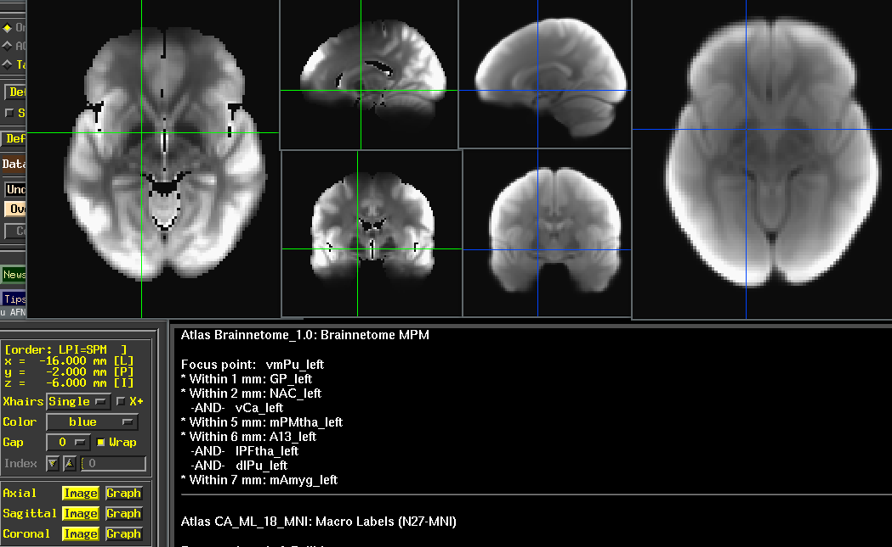
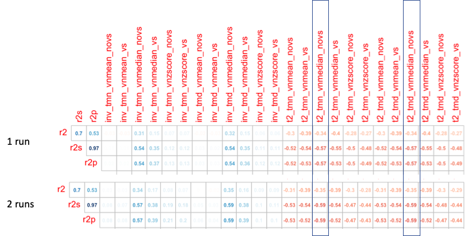
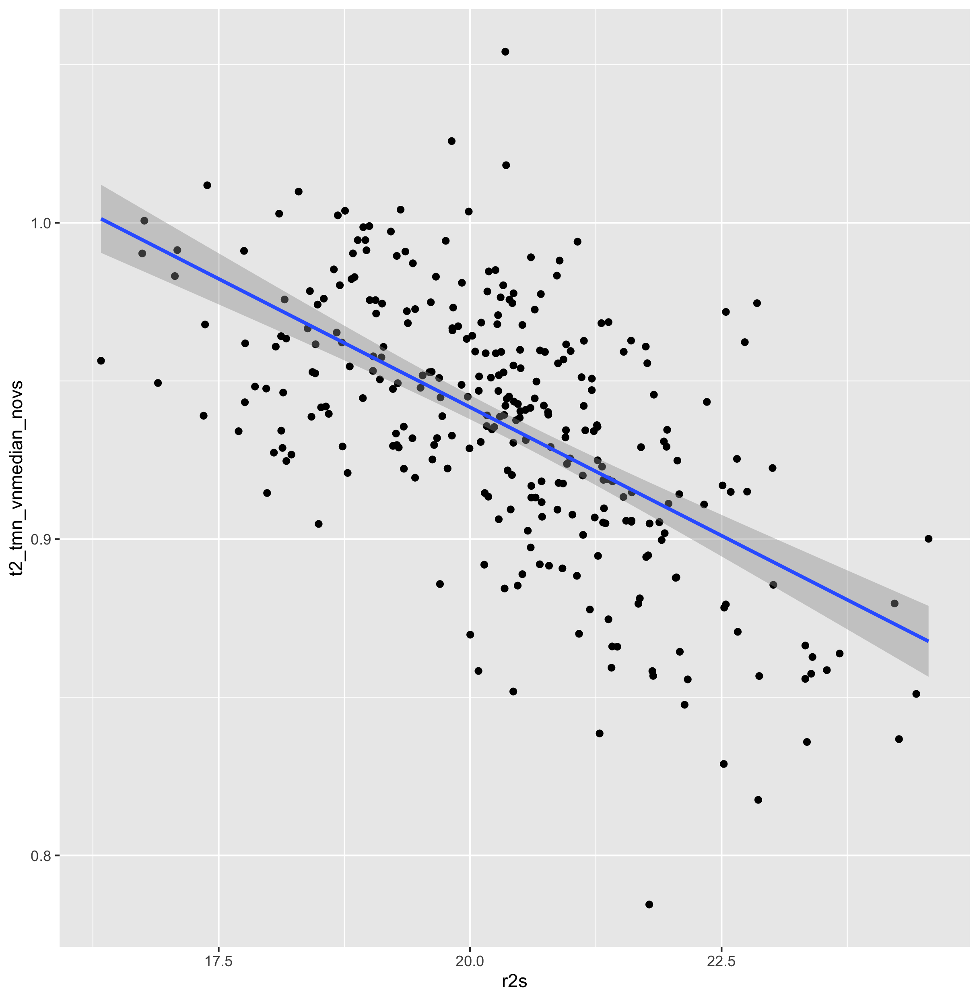

# LNCD Tools
small scripts useful for data wrangling at the LNCD 

[](https://travis-ci.com/LabNeuroCogDevel/lncdtools)

## Install
```
git clone https://github.com/LabNeuroCogDevel/lncdtools ~/lncdtools
echo "export PATH=\$PATH:$HOME/lncdtools" >> $( [ "$(uname)" == Darwin ] && echo ~/.profile || echo ~/.bashrc)
```

## Usage/cookbooks
  * TODO: [Makefile sentinels](/doc/mksentinels) for `make` using `mkifdiff`, `mkls`, `mkmissing`, `mkstat`
  * TODO: [BIDS](/doc/BIDS) with `dcmdirtab`, `dcmtab_bids`, and `mknii`

## Tools

  * `4dConcatSubBriks` -  extract a subbrick from a list of nifti label with luna ids. Useful for quality checking many structurals, subject masks, or individual contrasts. Wraps around 3dbucket and 3drefit: 
  * `img_bg_rm`  - use imagemagick's `convert` to set a background to alpha (remove). Taken from ["hackerb9" stack overflow solution](https://stackoverflow.com/questions/9155377/set-transparent-background-using-imagemagick-and-commandline-prompt). use on afni and suma screen captures
  * `mkmissing` - find missing patterns between two steps in a pipeline (file globs)
  * `r` - read dataframe from stdin and run R code with shortcuts and magic a la DataScienceToolkit's Rio
  * `tat2`, `melanin_align`  - modality specific wrappers

### tat2

[](imgs/tat2_examle.png)
(`/Volumes/Hera/Datasets/ABCD/TAT2/tat2_avg3797_med_voldisc.nii.gz` and `/Volumes/Hera/Projects/7TBrainMech/scripts/mri/tat2/mean_176.nii.gz`)


permutation of `tat2` calls were compared against R2 acquisitions:
`-vol_median` is likely the approprate normalization. <br>
[](imgs/tat2_matrix.png)
[](imgs/tat2_vs_r2prime.png) <br>
(`/Volumes/Phillips/mMR_PETDA/scripts/tat2/multiverse`)

## Notes

  * `get_ld8_age.R` requires R and the `LNCDR` package + access with the firewall (for db at `arnold.wpic.upmc.edu`)
