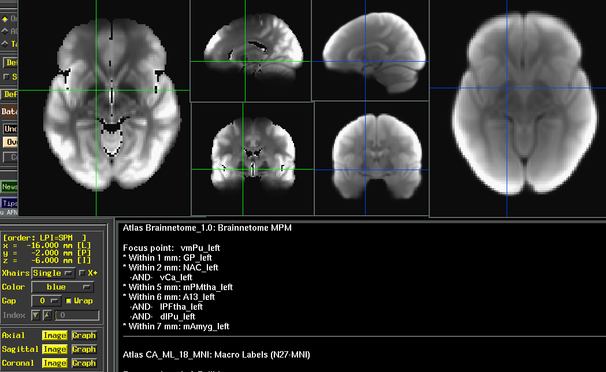

# LNCD Tools
A set of small data wrangling scripts at the LNCD.
[](https://zenodo.org/badge/latestdoi/152143120)

Detailed information in the [docs](https://lncd.github.io/lncdtools/)


## Install
See the [setup documentation](https://lncd.github.io/lncdtools/lncdtools_setup/).

Briefly clone and add to path
```
git clone https://github.com/lncd/lncdtools ~/lncdtools
echo "export PATH=\$PATH:$HOME/lncdtools" >> ~/.bashrc
```

## Usage/cookbooks
  * TODO: [Makefile sentinels](/docs/mksentinels.md) for `make` using `mkifdiff`, `mkls`, `mkmissing`, `mkstat`
  * [BIDS](/docs/BIDS.md) with `dcmdirtab`, `dcmtab_bids`, and `mknii`

## Tools

  * [shell wrappers](https://lncd.github.io/lncdtools/shell/) `niinote`, `skip-exist`,  `waitforjobs`, `dryrun`, `drytee` 
  * [`tat2`](https://lncd.github.io/lncdtools/tat2/) (cf. [`dR2*`](https://github.com/Larsen-Lab/dR2star)), `tsnr`, `melanin_align`  - modality specific wrappers
  * `4dConcatSubBriks` -  extract a subbrick from a list of nifti label with luna ids. Useful for quality checking many structurals, subject masks, or individual contrasts. Wraps around 3dbucket and 3drefit: 
  * `img_bg_rm`  - use imagemagick's `convert` to set a background to alpha (remove). Taken from ["hackerb9" stack overflow solution](https://stackoverflow.com/questions/9155377/set-transparent-background-using-imagemagick-and-commandline-prompt). use on afni and suma screen captures
  * `mkmissing` - find missing patterns between two steps in a pipeline (file globs)
  * `r` - read dataframe from stdin and run R code with shortcuts and magic a la DataScienceToolkit's Rio

### [tat2](https://lncd.github.io/lncdtools/tat2/)

> [!TIP]
>   * `tat2` is now (2026) `dR2*` and hosted https://github.com/Larsen-Lab/dR2star
>   * dR2* (née tat2) validation is also hosted in its [own repository `tat2-validation`](https://github.com/LabNeuroCogDevel/tat2-validation)

Also see more detaied [docs](https://lncd.github.io/lncdtools/tat2/)
[](docs/imgs/tat2_examle.png)


## Notes

  * `get_ld8_age.R` requires R and the `LNCDR` package + access with the firewall (for db at `arnold.wpic.upmc.edu`)
